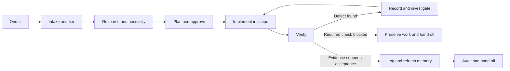

<div align="center">

# Project Delivery Loop

**Less “trust me.” More “show me.”**

An evidence-first skill for AI coding agents.<br>
Keep the context. Control the scope. Verify the work. Leave a useful handoff.

**v1.1.0 · Markdown project memory · Python 3.10+ tools · Standard library only**

[Why it exists](#why-it-exists) · [When to use it](#when-to-use-it) · [Quick start](#quick-start) · [Usage examples](#usage-examples) · [How it works](#how-it-works)

</div>

---

> Your agent can write the next feature. Can it explain **why it belongs**, prove
> **what passed**, and leave the project ready for the next session?
>
> **Project Delivery Loop turns those questions into a repeatable workflow.**

It combines an [Agent Skill](project-delivery-loop/SKILL.md), five project-state
ledgers, a structural audit, and installation adapters. It is not another coding
model, hosted service, project-management dashboard, or guarantee of bug-free code.

## Why it exists

AI-assisted development can move quickly while the reasoning and evidence fall
behind. This skill is designed to make that gap visible before it becomes a habit.

| The failure mode | The discipline this skill adds |
|---|---|
| A new session forgets the architecture | Read a concise project snapshot, then revalidate relevant facts against source |
| “Done” means files were edited | Map acceptance criteria to actual commands, outcomes, and coverage limits |
| A plausible guess becomes a project fact | Separate **VERIFIED**, **INFERRED**, **ASSUMED**, and **UNKNOWN** |
| One small fix becomes a rewrite | Declare scope, non-goals, dependencies, and approval gates |
| The same rejected idea returns | Preserve decisions, alternatives, and specific revisit triggers |
| Recovery risks someone else's edits | Preserve the working tree; ask before destructive operations |
| An agent stops with “almost finished” | Leave the blocker, evidence, owner, and one concrete next action |

**The goal is not more paperwork. It is fewer unsupported decisions.** A small
copy edit gets a small process. An auth change or migration gets stronger gates.

## When to use it

Use it when you are:

- **Starting work on an existing app** and need source-backed project orientation.
- **Adding a feature** that must fit the current architecture rather than replace it.
- **Fixing a bug** and want reproduction, root-cause evidence, and regression coverage.
- **Refactoring or migrating** with explicit boundaries, compatibility checks, and rollback planning.
- **Resuming after a break** or handing work to another person or agent.
- **Working across coding tools** and want portable project records instead of chat-only memory.
- **Reviewing a project** and need facts, uncertainties, and recommendations kept separate.

**Use a lighter touch** for throwaway experiments and trivial edits. Read-only
questions stay read-only: asking for an explanation is not permission to create
ledgers, edit code, install tools, commit, or deploy.

## Quick start

### 1. Get the source and preview the install

Clone or download this repository, then open a terminal at **its root**. The
current editable source is in [`project-delivery-loop/`](project-delivery-loop/).
Root `.zip` and `.skill` archives may be older snapshots; do not assume they match
v1.1.0 without rebuilding and verifying them.

You need **Python 3.10+** and a coding agent that can load skills or instruction
files. There is no `pip install` step for this package's tools. Your agent's own
subscription, API, and permission requirements still apply.

Replace the example target with a **separate, existing application repository**.
The preview below creates no files:

```bash
python -B project-delivery-loop/scripts/install_skill.py --repo "/path/to/my-app" --dry-run
```

On Windows, use a path such as `"C:\code\my-app"`. Use `python3` instead of
`python` if that is your Python 3 executable.

### 2. Install into the application

After reviewing the preview:

```bash
python -B project-delivery-loop/scripts/install_skill.py --repo "/path/to/my-app" --init-ledgers --name "My App"
```

The default installs the skill under `.devin/skills/project-delivery-loop/` in
that application. `--init-ledgers` creates missing project ledgers without
replacing existing ones. It creates a **planned orientation task**, not invented
project history or proof that the app works.

<details>
<summary><strong>Bash and PowerShell wrappers, compatibility tools, and global installs</strong></summary>

From this repository's root, Bash:

```bash
bash project-delivery-loop/install.sh --repo "/path/to/my-app" --dry-run
bash project-delivery-loop/install.sh --repo "/path/to/my-app" --init-ledgers --name "My App" --offset +05:30
```

PowerShell:

```powershell
.\project-delivery-loop\install.ps1 -Repo "C:\code\my-app" -DryRun
.\project-delivery-loop\install.ps1 -Repo "C:\code\my-app" -InitLedgers -Name "My App" -Offset "+05:30"
```

For other supported coding tools, explicitly opt into the compatibility bundle:

```bash
bash project-delivery-loop/install.sh --repo "/path/to/my-app" --all-tools --dry-run
bash project-delivery-loop/install.sh --repo "/path/to/my-app" --all-tools --init-ledgers
```

PowerShell equivalents are `-AllTools`, `-DryRun`, and `-InitLedgers`. The bundle
writes adapters for multiple tools, not just whichever editor is currently open;
review its dry-run before opting in.

Add `--user` / `-User` only when you also want a global copy at
`~/.config/devin/skills/project-delivery-loop/`. Project-only installation is the
default. The direct Python entry point does not have `--user` or `--all-tools`;
use the wrappers for those options.

PowerShell must be allowed by your organization's signing/execution policy.
Do not disable that policy. Use the Python entry point only where it is permitted
by the same environment's rules.

</details>

### 3. Ask your agent to reconstruct the project

Open the **target application** in your coding agent and send:

```text
Use the project-delivery-loop skill.

Reconstruct project memory from the actual source, configuration, tests,
and commands you can inspect. Separate verified facts from assumptions
and unknowns. Identify active work, invariants, and blockers.

Do not change application code or invent features, test results, or deployment
status. Keep the bootstrap task open until its acceptance checks are met.
```

In hosts that expose slash-command skills, invoke `/project-delivery-loop`.
Otherwise ask the agent to read the installed `SKILL.md` directly. Reload the
workspace/session if your host requires it for newly installed instructions.

### 4. Make a bounded request and review the evidence

```text
Use project-delivery-loop to add CSV export to the existing orders screen.
Reuse current patterns. Do not change authentication or introduce a new service.
Define acceptance checks, confirm the risk tier, and request approval if needed.
After implementation, report actual verification, limits, and the next action.
```

Once orientation is complete, run this from the **target application's root**:

```bash
python -B .devin/skills/project-delivery-loop/scripts/ledger_check.py --root .
```

An untouched memory template is expected to fail the audit. That is intentional:
**an empty snapshot should not look like verified project knowledge.**

## Usage examples

| You want to… | Ask the agent… |
|---|---|
| Understand unfamiliar code | “Explain this request path using inspected files. Label anything inferred. Do not edit.” |
| Fix a regression | “Reproduce the reported failure, record it, add a failing regression test, then make the smallest fix.” |
| Plan a risky change | “Plan this schema migration, identify compatibility and recovery risks, and wait for approval before implementation.” |
| Resume safely | “Read the ledgers, check the current tree against the handoff, and tell me the next safe action before proceeding.” |
| Avoid over-engineering | “Compare reuse, a minimal implementation, and doing nothing. Explain what we are deliberately not building.” |
| Close a session | “Update actual project state. Separate completed, partial, and blocked work. Name the next action and owner.” |

### What a useful handoff looks like

An illustrative handoff—not a test result from this repository:

```text
Implemented: CSV export in the existing orders module.
Verification: Targeted tests passed; command and output recorded in CHANGES.md.
Blocked: Full integration suite could not run; database sandbox unavailable.
Status: IN_REVIEW, not DONE. Delivery: NOT_DEPLOYED.
Next action: Project owner provides sandbox access; agent reruns the required suite.
```

The distinction matters: **implemented is not verified, and verified is not deployed.**

## How it works



A defect can enter the loop at any phase. New evidence can also send work back
to planning. The diagram describes the workflow, not an autonomous orchestration
engine that runs by itself.

| Risk tier | Typical change | Expected discipline |
|---|---|---|
| **T0 · Trivial** | Copy or formatting without behavior/policy impact | Brief plan and relevant checks |
| **T1 · Standard** | Contained fix or feature in an existing module | Local research, scoped implementation, applicable verification |
| **T2 · Significant** | New dependency, schema, auth, integration, public contract | Written decision, explicit approval, integration/negative checks |
| **T3 · Hazardous** | Production data operations, billing, hard-to-reverse changes | T2 plus action-specific approval, recovery evidence, staged execution |

No risk tier overrides the host's permissions or authorizes destructive actions.
Read the [full skill](project-delivery-loop/SKILL.md) or the
[tiering guide](project-delivery-loop/references/01-intake-and-tiering.md).

## Five files. One shared project memory.

| Ledger | The question it answers |
|---|---|
| [`MEMORY.md`](project-delivery-loop/templates/MEMORY.md) | What is this project, what is true now, and where do I look? |
| [`TASKS.md`](project-delivery-loop/templates/TASKS.md) | What matters next, who owns it, and what does it depend on? |
| [`CHANGES.md`](project-delivery-loop/templates/CHANGES.md) | What actually changed, and what evidence supports the result? |
| [`BUGS.md`](project-delivery-loop/templates/BUGS.md) | What failed, how do we reproduce it, and what confirms the fix? |
| [`DECISIONS.md`](project-delivery-loop/templates/DECISIONS.md) | Why did we choose this—and what would make us reconsider? |

These are plain Markdown, designed to travel with the application repository.
They are not replacements for source code, tests, or an existing issue tracker.
Use unique task/change/bug/decision IDs, real offset timestamps, and source-backed
facts. Keep memory concise; preserve full historical definitions when archiving.

**Facts have states, too:**

- **VERIFIED:** a specific inspected source or observed result supports the claim.
- **INFERRED:** evidence supports a conclusion that has not been directly observed.
- **ASSUMED:** an explicit, reversible default—not a discovered fact.
- **UNKNOWN:** missing, inaccessible, or conflicting evidence, with a next check.

See the [ledger schemas](project-delivery-loop/references/04-ledger-schemas.md)
and [grounding guide](project-delivery-loop/references/02-research-and-necessity.md).

## Works with your tools, not against them

| Installation | What the package supplies |
|---|---|
| **Default: Devin** | A project skill in `.devin/skills/` |
| **Opt-in skill copies** | `.agents/skills/`, `.claude/skills/`, `.codex/skills/`, `.github/skills/` |
| **Opt-in instruction adapters** | Claude Code, Codex-style AGENTS instructions, Copilot, Cursor, Gemini, Windsurf, Cline, Roo, Amazon Q, Junie, Zed, Aider |
| **Manual use** | Read the skill and references in a host that can follow repository instructions |

These are supplied integration files, not a claim that every editor/version has
been end-to-end certified. Loading behavior and available tools depend on the
host. Its instruction hierarchy and security controls always take precedence.

No external model API, database, task service, or Graphify installation is required
by the audit/install tools. Optional project graphs can help navigation; they are
not a substitute for checking current source.

## Safety by design, honesty by contract

**The installer** previews writes, checks ownership, refuses conflicting local
edits, preserves unrelated files, and keeps backups of updates. It rejects linked
or overlapping destinations. Individual replacements are atomic; an entire
multi-file installation is **not** transactional. Review a partial failure before
retrying. No directory deletion or automatic rollback is performed.

**The workflow** asks for authorization before significant or destructive work,
preserves user changes, and keeps incomplete verification visible. These are
agent instructions, not a sandbox that can force every host/model to comply.

**The checker** catches structural issues such as missing evidence fields,
placeholder completion records, invalid primary task links, absent ownership,
approval-shape problems, cycles, dangling IDs, timestamps, and probable secrets.

**It cannot prove** that an agent ran a command, that prose is true, that an owner
approved a change, that a SHA exists, or that production is healthy. It is not a
comprehensive secret scanner. Never store credentials or customer data in ledgers.

There is no “zero hallucinations” claim here. There is a workflow that makes
unsupported claims harder to hide and easier to question.

## Audit and maintain

Run these from **this repository's root**, replacing the target path:

```bash
python -B project-delivery-loop/scripts/ledger_check.py --root "/path/to/my-app"
python -B project-delivery-loop/scripts/ledger_check.py --root "/path/to/my-app" --strict
python -B project-delivery-loop/scripts/ledger_rotate.py --root "/path/to/my-app" --dry-run
```

Checker exit codes: **0** = no errors, **1** = validation failed,
**2** = setup/read error. Warnings do not fail the default audit; `--strict` makes
them fail. Inspect rotation output and obtain approval before rewriting ledgers.
The rotator does not automatically archive tasks.

For upgrades, install from a separate source directory and preview first. Do not
invent historical approvals or test results to satisfy a new schema. Preserve the
record, mark unsupported work appropriately, and append corrections with evidence.

[Detailed installation and upgrade behavior](project-delivery-loop/README.md)

## Test the skill's tools

From this repository's root:

```bash
python -B -m unittest discover -s project-delivery-loop/scripts -p "test_*.py"
```

Tests use synthetic ledgers and temporary directories, not real application data
or global installations. They cover the checker, initialization, archive linkage,
installer conflicts/backups/idempotency, path handling, and adapter consistency.

<details>
<summary><strong>Verification snapshot and current platform limits</strong></summary>

The recorded local run on **14 September 2026**, Windows with Python 3.14.4,
ran **54 tests: 52 passed, 1 failed, 1 skipped**.

- The failed check was native PowerShell execution: the environment rejected the
  unsigned script before it could run. PowerShell syntax validation passed.
- The real symlink test was skipped because the OS denied creating its fixture.
- Bash syntax and the remaining executable checks passed.

This is a dated local result, **not a green CI badge or cross-platform certification**.
Rerun the command above for the current state. Required checks blocked by signing
or permissions remain open; do not disable security controls to make them pass.

</details>

## Troubleshooting

| Symptom | What to do |
|---|---|
| The agent does not load the skill | Check the actual installed path and host discovery rules; reload if needed, or ask it to read SKILL.md directly |
| The first audit fails after initialization | Reconstruct memory and replace placeholders with supported facts or explicit unknowns; do not fabricate a pass |
| Upgrade refuses an existing file | Inspect local edits and ownership records; reconcile manually or install into a separate clean destination |
| PowerShell refuses the script | Use an approved signing/test environment; do not bypass execution policy |
| A required test cannot run | Keep the task BLOCKED/IN_REVIEW, record the exact limitation, and name the owner action needed |
| Git still shows an ignored file | `.gitignore` does not untrack existing files; review tracked content separately rather than deleting it blindly |

## Repository map

```text
.
├── README.md
├── .gitignore
└── project-delivery-loop/
    ├── SKILL.md
    ├── README.md
    ├── install.sh
    ├── install.ps1
    ├── references/
    ├── templates/
    ├── adapters/
    └── scripts/
        ├── ledger_init.py
        ├── ledger_check.py
        ├── ledger_rotate.py
        ├── install_skill.py
        └── test_delivery_loop.py
```

The map highlights the editable source, not every legacy archive in the folder.
The root `.gitignore` excludes local Python environments/caches, coverage/build
output, environment secrets, installer backups, and generated Graphify output.
It deliberately keeps source, safe `.env` examples, ledger records, shared agent
configuration, ownership manifests, and archive files eligible for version control.
Ignoring a file does not remove it from disk or protect an already-tracked secret.

## Contributing

Useful contributions make the workflow more trustworthy **without making it
ceremonial**. Good starting points include:

- Reproducible checker edge cases and stronger regression tests.
- Verified platform/editor compatibility fixes with exact environment details.
- Clearer examples that help a new user succeed without inventing evidence.
- Simpler instructions where the same safeguard can be expressed with less overhead.

For a bug report, include the version, platform, safe reproduction, expected/actual
behavior, command outcome, and a minimal synthetic example. **No secrets or
customer data.** For a change, explain the need, keep scope focused, update affected
adapters/docs, and report the actual test result—including blocked checks.

Feature ideas should explain the user outcome, why existing behavior is
insufficient, and the smallest useful form. Reuse and doing nothing are legitimate
alternatives, not failures of ambition.

## Licensing and release readiness

[`SKILL.md`](project-delivery-loop/SKILL.md) declares **MIT** in its metadata.
A standalone repository `LICENSE` file with the correct copyright notice is not
yet present; that is a maintainer action before treating the repository as a
fully documented public release. This README does not invent the rights holder.

Use the source version and actual verification evidence when preparing a release.
Refresh and validate distributable archives deliberately; do not relabel an older
archive or imply that local results establish universal compatibility.

---

<div align="center">

**Build useful things. Leave evidence. Make the next session easier.**

If this workflow helps, share a concrete example, contribute a reproducible fix,
or star the repository so others can discover it.

[Start with the skill](project-delivery-loop/SKILL.md) · [Read the rationale](project-delivery-loop/references/06-gap-analysis.md) · [Review the verification contract](project-delivery-loop/references/03-implement-and-verify.md)

</div>
